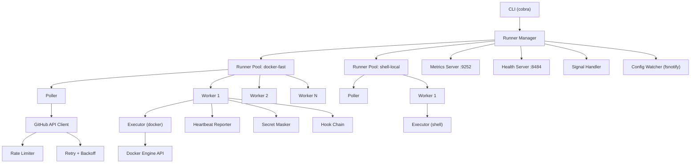
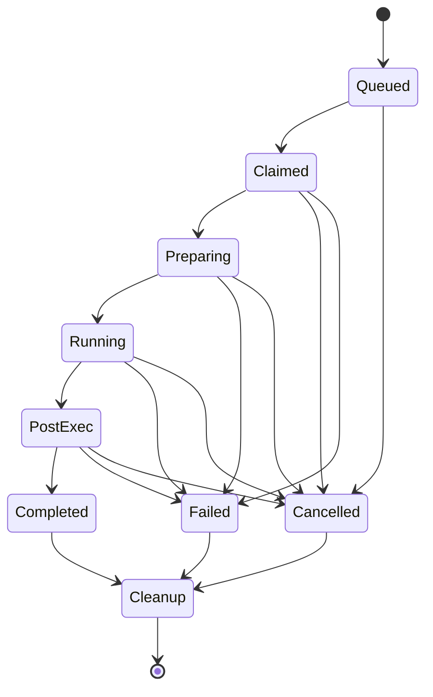

# Architecture

This document describes the internal architecture of github-runner, including
its component structure, data flow, concurrency model, and shutdown behavior.

## System overview

github-runner is a single-binary process that manages one or more **runner
pools**. Each pool maps to a `[[runners]]` entry in the config file and
operates independently with its own executor type, concurrency level, and
GitHub API credentials.

```
┌─────────────────────────────────────────────────┐
│                   CLI (cobra)                    │
├─────────────────────────────────────────────────┤
│              Runner Manager (1 per process)      │
│  ┌──────────┐ ┌──────────┐ ┌──────────┐        │
│  │ Worker 1 │ │ Worker 2 │ │ Worker N │  ...    │
│  │ (Job)    │ │ (Idle)   │ │ (Job)    │        │
│  └──────────┘ └──────────┘ └──────────┘        │
├─────────────────────────────────────────────────┤
│  Executor Layer   │  Cache Layer  │  Artifact   │
│  (shell/docker/   │  (local/s3/   │  Manager    │
│   k8s/firecracker)│   gcs)        │             │
├─────────────────────────────────────────────────┤
│  GitHub API Client │ Metrics │ Health │ Logger   │
└─────────────────────────────────────────────────┘
```

## Component diagram



## Components

### Runner Manager (`internal/runner/manager.go`)

The top-level orchestrator. One instance per process. Responsibilities:

- Creates and supervises runner pools based on config
- Starts metrics and health HTTP servers
- Handles OS signals (SIGTERM/SIGINT for shutdown, SIGHUP for reload)
- Coordinates graceful shutdown with timeout enforcement

### Runner Pool (`internal/runner/pool.go`)

One pool per `[[runners]]` config entry. Each pool:

- Runs a **Poller** goroutine that queries the GitHub API for available jobs
- Maintains a buffered channel of jobs (buffer size = concurrency)
- Spawns **Worker** goroutines that pull from the channel
- Tracks active job count via `atomic.Int64`

### Worker (`internal/runner/worker.go`)

A worker executes a single job through its lifecycle:

1. Registers secrets for log masking
2. Starts heartbeat reporter in a background goroutine
3. Transitions through the lifecycle state machine
4. Runs pre-job hooks
5. Calls `Executor.Prepare()` to set up the environment
6. Executes steps sequentially via `Executor.Run()`
7. Runs post-job hooks
8. Reports final status to GitHub
9. Calls `Executor.Cleanup()` (always, even on failure)

### Poller (`internal/runner/poller.go`)

Polls the GitHub API at a configured interval. Features:

- Exponential backoff on consecutive errors (up to 5 minutes)
- Automatic interval reset after successful poll
- Blocks on the job channel when all workers are busy

### Lifecycle (`internal/runner/lifecycle.go`)

A state machine that enforces valid job state transitions:



Every transition is validated, logged, and reported to GitHub.

## Concurrency model

### Goroutine topology

```
main goroutine
└── Manager.Start()
    ├── signal handler         (1 goroutine)
    ├── metrics server         (1 goroutine)
    ├── health server          (1 goroutine)
    │
    ├── Pool "docker-fast"     (1 goroutine)
    │   ├── Poller             (1 goroutine)
    │   ├── Worker 0           (1 goroutine per active job)
    │   │   ├── heartbeat      (1 goroutine)
    │   │   └── executor I/O   (managed by executor)
    │   ├── Worker 1
    │   └── ...Worker N
    │
    └── Pool "shell-local"     (1 goroutine)
        ├── Poller             (1 goroutine)
        └── Worker 0..M
```

### Synchronization strategy

| Resource | Mechanism | Notes |
|----------|-----------|-------|
| Job dispatch channel | Buffered channel | Size = pool concurrency |
| Active job count | `atomic.Int64` | Lock-free reads for metrics |
| Config state | `sync.RWMutex` | Writer: config watcher. Readers: pools. |
| Lifecycle state | `sync.RWMutex` | Per-job, no sharing between workers |
| Shutdown coordination | `context.Context` + `sync.WaitGroup` | Cancel propagates to all goroutines |
| Secret masker patterns | `sync.RWMutex` | Writers: `AddSecret`. Readers: `Write`/`MaskString`. |
| Cache index (local) | `sync.RWMutex` + file lock | Mutex for in-process safety, flock for multi-process |
| Metrics counters | Prometheus client internals | Atomic internally, no additional sync |
| Rate limit state | `sync.RWMutex` | Updated from response headers |

### Design rules

- Workers never share mutable state. Each worker gets its own masker, executor
  instance, and lifecycle tracker.
- All inter-goroutine communication uses channels or context cancellation.
- Every goroutine respects `ctx.Done()` for clean shutdown.
- `defer` is used for all cleanup to ensure resources are released on every
  code path.

## Shutdown sequence

```
1. SIGTERM or SIGINT received
2. Root context cancelled → propagates to all pools and workers
3. Pollers stop accepting new jobs immediately
4. Health server reports not-ready (/readyz returns 503)
5. In-flight workers:
   a. Current step completes (bounded by shutdown_timeout)
   b. Executor.Cleanup() called
   c. Job status reported to GitHub as cancelled
6. WaitGroup.Wait() blocks until all workers finish
7. Metrics and health servers shut down
8. Process exits with code 0

If shutdown_timeout expires:
  - Warning logged with list of still-running jobs
  - Process exits with code 1
```

## Data flow: job lifecycle

```
GitHub API                    Runner                         Executor
    │                           │                               │
    │◄── poll (GET /jobs) ──────│                               │
    │── job payload ───────────►│                               │
    │                           │── Prepare() ─────────────────►│
    │◄── status: in_progress ───│                               │
    │                           │── Run(step 1) ───────────────►│
    │◄── heartbeat ─────────────│                               │
    │◄── step status ───────────│◄── StepResult ────────────────│
    │                           │── Run(step 2) ───────────────►│
    │◄── heartbeat ─────────────│                               │
    │◄── step status ───────────│◄── StepResult ────────────────│
    │                           │                               │
    │◄── status: completed ─────│                               │
    │                           │── Cleanup() ─────────────────►│
    │                           │                               │
```

## Package dependency graph

```
cmd/github-runner
  └── internal/cli
        ├── internal/config
        ├── internal/runner
        │     ├── internal/executor
        │     ├── internal/github
        │     ├── internal/hook
        │     └── internal/secret
        ├── internal/metrics
        ├── internal/health
        ├── internal/log
        └── internal/version

internal/executor
  ├── internal/executor/shell
  ├── internal/executor/docker
  ├── internal/executor/kubernetes
  └── internal/executor/firecracker

internal/cache (standalone)
internal/artifact (standalone)
internal/job (depends on executor, api)
pkg/api (no internal dependencies)
```

No circular dependencies exist. `pkg/api` is the leaf package that all others
import. Internal packages import downward only.
